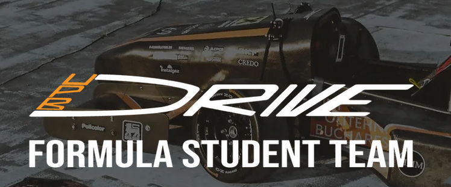
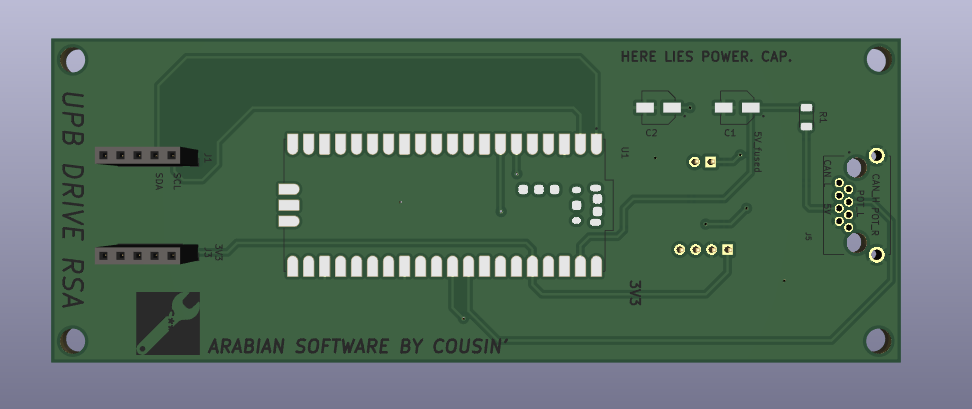

# RSA = Rear Sensor Array

## Description
This code runs bare metal on Raspi Pi Pico.

It collects data via I2C from an accelerometer / magnetometer

It also measures 2 suspension sensors

Parses data and sends it via CAN BUS

I also finished the design of the PCB for this module

It connects via an ethernet connector to the VCC GND and CAN bus of the car

This was a great choice, because the ethernet cables have a small footprint and 8 cables are already bundled toghether

## This module is made for the FSA car of UPB Drive
Find us <a href="https://www.upbdrive.com/">here</a>

## File structure, explained
Here you wil find all the docs, pcb files and firware needed for RSA

## Other?
Nada

